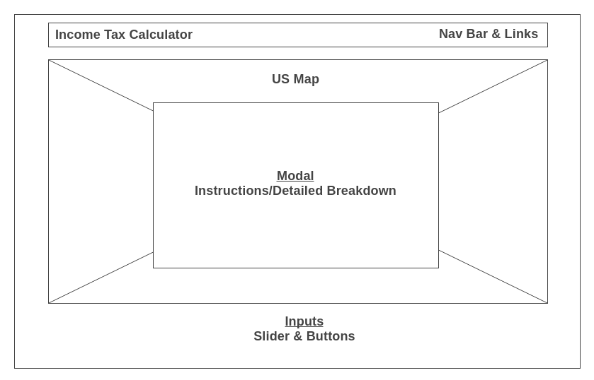
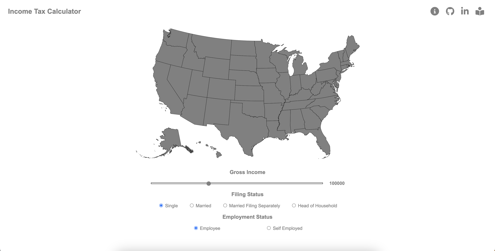
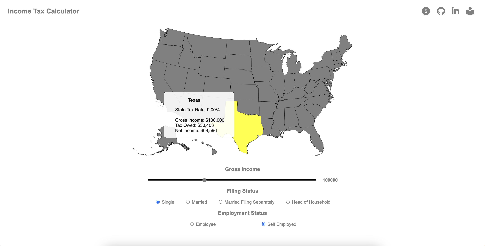
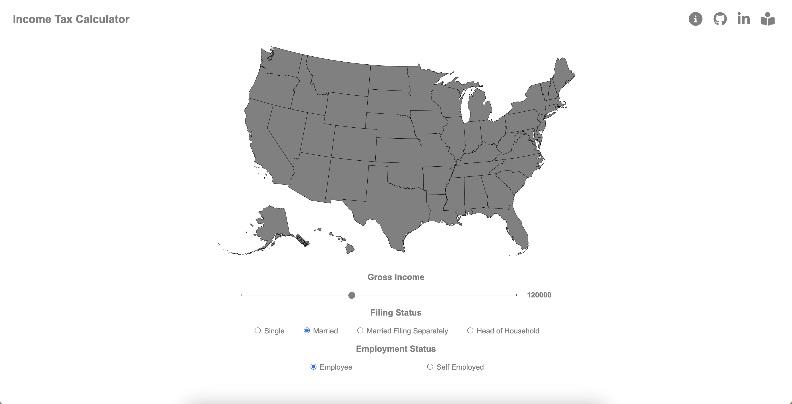
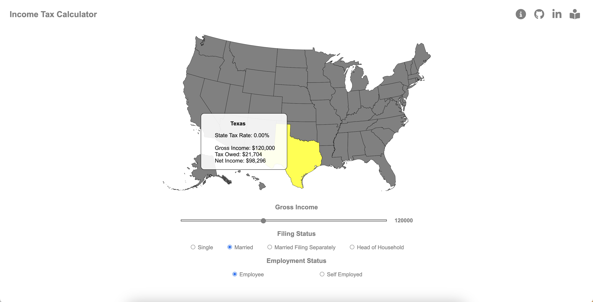
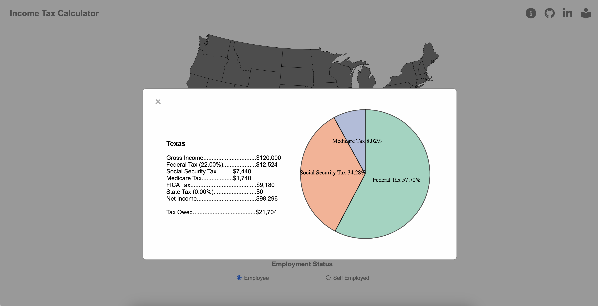

# Income Tax by State

## Background

This project is a data visualizer that shows the estimated tax owed for each state based on three parameters: gross income, filing status, and employment status. Users can adjust their parameters using the slider and buttons below the map to meet their specific needs. By hovering over any state, a tooltip box will display the estimated tax and net income. For more information about the calculated tax amount, users can click on the state for a detailed breakdown. The goal of this application is to provide users a simple way of estimating his or her taxes.

## Wireframe



- Nav Bar & Links includes icon links to app instructions, GitHub, and LinkedIn
- US Map renders the US map with clickable and hoverable states
- Inputs: Slider & Buttons allows users to adjust parameters necessary for tax calculations
- Modal: Instructions/Detailed Breakdown displays instructions on how to use the app or detailed breakdown by state depending on whichever is clicked

## Functionality & MVPs

In this data visualizer, users will be able to:

- Hover over states to display estimated income tax owed




- Upon hover over any state, a new State object is instantiated for that state. The calculation functions in the object are invoked to return the estimated tax. The results are displayed in the tooltip box that appears.

```js
    .on("mouseover", function(d) {
        // Hover color
        d3.select(this).classed("selected", true);

        // Hover tooltip box
        d3.select("#tooltip")
        .style("opacity", 0.9);

        // Create state object
        const filingStatus = d3.select("input[name='filingStatus']:checked").node().value
        const employmentStatus = d3.select("input[name='employmentStatus']:checked").node().value
        const currentState = new State(d, filingStatus, employmentStatus);
        
        // Get income data
        const grossIncome = Number(d3.select("#gross-income").html());

        const tooltipRows = [
            `State Tax Rate: ${Number.parseFloat(currentState.calculateStateMarginalTaxRate(currentState.name, grossIncome, filingStatus)).toFixed(2)}%`,
            "<br>", 
            `Gross Income: $${grossIncome.toLocaleString("en-US")}`,
            `Tax Owed: $${Math.floor(currentState.calculateFederalTax(grossIncome, filingStatus) 
                + currentState.calculateSocialSecurityTax(grossIncome, employmentStatus) 
                + currentState.calculateMedicareTax(grossIncome, employmentStatus) 
                + currentState.calculateStateTax(currentState.name, grossIncome, filingStatus)).toLocaleString("en-US")}`,
            `Net Income: $${Math.floor(grossIncome 
                - (currentState.calculateFederalTax(grossIncome, filingStatus) 
                + currentState.calculateSocialSecurityTax(grossIncome, employmentStatus) 
                + currentState.calculateMedicareTax(grossIncome, employmentStatus) 
                + currentState.calculateStateTax(currentState.name, grossIncome, filingStatus))).toLocaleString("en-US")}`,
        ]

        // Display calculated information in hover tooltip box
        d3.select("#hoverBoxContainer").remove()
        d3.select("#hoverBoxName").remove()

        d3.select("#tooltip")
            .append("div")
            .attr("id", "hoverBoxName")
            .style("font-weight", "bold")
            .style("padding-top", "20px")
            .text(`${(currentState.titleize(currentState.name))}`)

        d3.select("#tooltip")
            .append("ul")
            .attr("id", "hoverBoxContainer")
            .selectAll("li")
            .data(tooltipRows)
            .enter()
            .append("li")
            .html(String);
    })
```

- Adjust income, filing status, and employment status with slider and buttons to meet individual needs. A new State object is instantiated with the newly adjusted inputs to calculate a new estimated tax owed upon hover.




- Click on state for detailed breakdown of the estimated tax



- Upon click of any state, a new State object is instantiated. A detailed breakdown and pie chart of the tax owed are created and displayed. The detailed breakdown includes the different taxes that make up the estimated tax owed.

```js
.on("click", function(d) {
        // Reset modal
        d3.select("#pieChart").remove()
        d3.select("#detailedBreakdown").remove()
        d3.select("#instructions").remove()

        // Create state object
        const filingStatus = d3.select("input[name='filingStatus']:checked").node().value
        const employmentStatus = d3.select("input[name='employmentStatus']:checked").node().value
        const currentState = new State(d, filingStatus, employmentStatus)

        // Get income data
        const grossIncome = d3.select("#gross-income").html();

        // Calculate numbers
        const federalTax = Math.floor(currentState.calculateFederalTax(grossIncome, filingStatus))
        const socialSecurityTax = Math.floor(currentState.calculateSocialSecurityTax(grossIncome, employmentStatus))
        const medicareTax = Math.floor(currentState.calculateMedicareTax(grossIncome, employmentStatus))
        const stateTax = Math.floor(currentState.calculateStateTax(currentState.name, grossIncome, filingStatus))
        const federalTaxRate = Number.parseFloat(currentState.calculateFederalMarginalTaxRate(grossIncome, filingStatus)).toFixed(2)
        const stateTaxRate = Number.parseFloat(currentState.calculateStateMarginalTaxRate(currentState.name, grossIncome, filingStatus)).toFixed(2)

        // Display modal
        document.getElementById("myModal").style.display = "block"

        renderChart(currentState.titleize(currentState.name), grossIncome, federalTax, socialSecurityTax, medicareTax, stateTax, federalTaxRate, stateTaxRate);
    })
```

- The pie chart visually depicts the different types of taxes that are used to calculate the estimated tax owed and its percentage proportion to the total tax owed.

```js
    const width = 450,
    height = 450,
    margin = 40;

    const radius = Math.min(width, height) / 2 - margin

    const svg = d3.select(".modal-content")
    .append("svg")
    .attr("id", "pieChart")
    .attr("width", width)
    .attr("height", height)
    .append("g")
    .attr("transform", `translate(${width / 2}, ${height / 2})`);

    const color = d3.scaleOrdinal()
    .range(d3.schemeSet2);

    const pie = d3.pie()
    .value(function(d) {return d[1]})
    const data_ready = pie(Object.entries(data))

    const arcGenerator = d3.arc()
    .innerRadius(0)
    .outerRadius(radius)

    svg
    .selectAll('mySlices')
    .data(data_ready)
    .join('path')
    .attr('d', arcGenerator)
    .attr('fill', function(d){ return(color(d.data[0])) })
    .attr("stroke", "black")
    .style("stroke-width", "2px")
    .style("opacity", 0.7)

    svg
    .selectAll('mySlices')
    .data(data_ready)
    .join('text')
    .text(function(d){ return d.data[0] + ` ${(Number.parseFloat((d.data[1] / totalTaxOwed(federalTax, socialSecurityTax, medicareTax, stateTax)) * 100).toFixed(2))}%`})
    .attr("transform", function(d) { return `translate(${arcGenerator.centroid(d)})`})
    .style("text-anchor", "middle")
    .style("font-size", 17)
```


## Technologies, Libraries, APIs

- Vanilla Javascript/HTML/CSS
- Webpack
- D3.js
- Chart.js

## Implementation Timeline

- Friday Afternoon & Weekend - Complete final proposal, research technologies, libraries & APIs, build backend logic
- Monday - Continue building backend logic, implement D3.js to build frontend (map & colors)
- Tuesday - Continue building frontend (hover, slider), implement click to expand view
- Wednesday - Add selector for different filing statuses
- Thursday Morning - Polish UI, deploy to GitHub

## Future Implementation

- Implement color coded map according to marginal state tax rate for given gross income
- Add info icon to display description about specific terms such as filing status, employment status, etc.
- Update tax rates to current year


