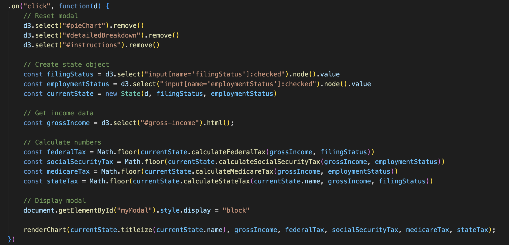
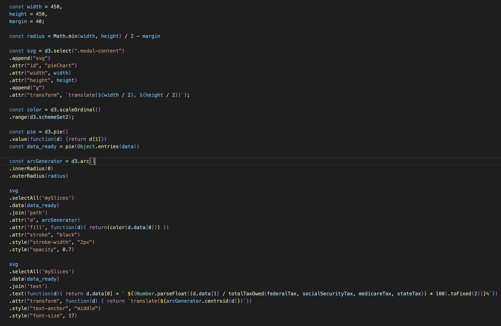

# Income Tax by State

## Background

This project is a data visualizer that shows an estimated tax amount owed for each state based on the user's gross income, filing status, and employment status. By hovering over a state on the map, users can view their estimated tax owed and net income. To view additional information about what the tax owed amount entails, the user can click on the state to view a detailed breakdown. The user may adjust the three parameters: gross income, filing status, and employment status to view the calculation that best suits his or her needs. The goal of this application is to provide users a simple way of estimating his or her taxes.

## Wireframe

- Nav Bar & Links includes icon links to app instructions, GitHub, and LinkedIn
- US Map renders the US map with clickable and hoverable states
- Inputs: Slider & Buttons allows users to adjust parameters necessary for tax calculations
- Modal: Instructions/Detailed Breakdown displays instructions on how to use the app or detailed breakdown by state depending on which user clicks

## Functionality & MVPs

In this data visualizer, users will be able to:

- Hover over states to display estimated income tax owed

- Upon hover over any state, a new State object is instantiated according to which state is being hovered. All calculation functions in the object are invoked to calculate estimated tax owed. The results are displayed in the hoverbox that appears on hover.

- Adjust income, filing status, and employment status with slider and buttons to meet individual needs. Upon hover, a new State object is instantiated with the newly adjusted inputs to calculate a new estimated tax owed.

- Click on individual states for detailed breakdown of taxes owed

- Upon click on any state, a detailed breakdown of the tax owed and pie chart are displayed. The detailed breakdown includes the different taxes that make up the estimated tax owed. 

- The pie chart visually depicts the different types of taxes that are used to calculate the estimated tax owed and its percentage proportion to the total tax owed.

## Technologies, Libraries, APIs

- Vanilla Javascript/HTML/CSS
- Webpack
- D3.js
- Chart.js

## Implementation Timeline

- Friday Afternoon & Weekend - Complete final proposal, research technologies, libraries & APIs, build backend logic
- Monday - Continue building backend logic, implement D3.js to build frontend (map & colors)
- Tuesday - Continue building frontend (hover, slider), implement click to expand view
- Wednesday - Add selector for different filing statuses
- Thursday Morning - Polish UI, deploy to GitHub

## Future Implementation

- Implement color coded map according to marginal state tax rate for given gross income
- Add info icon to display description about specific terms such as filing status, employment status, etc.
- Update tax rates to current year

